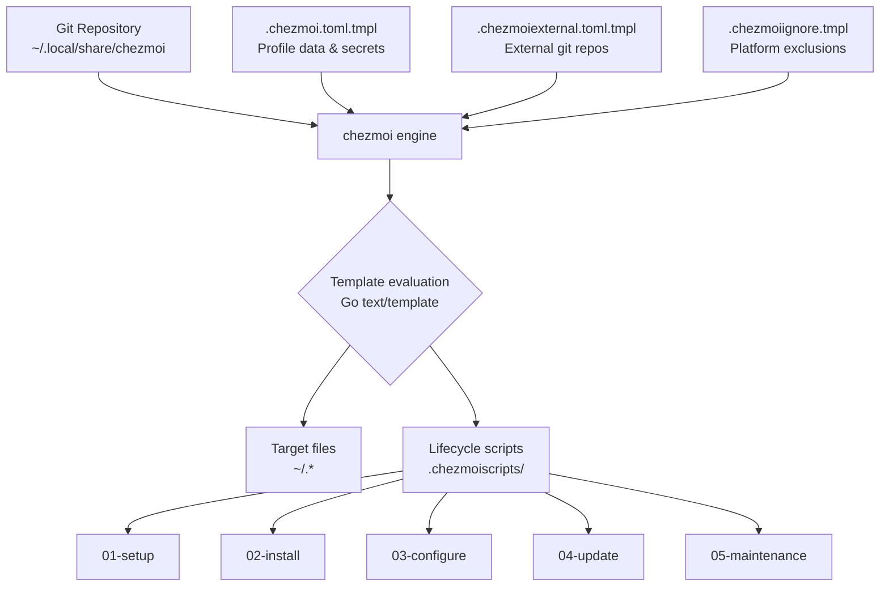
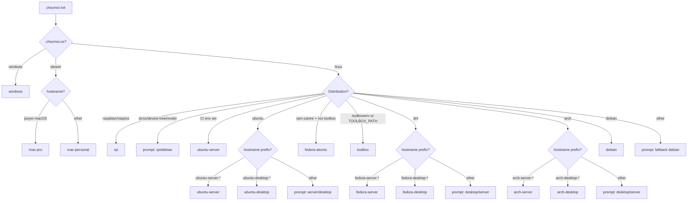
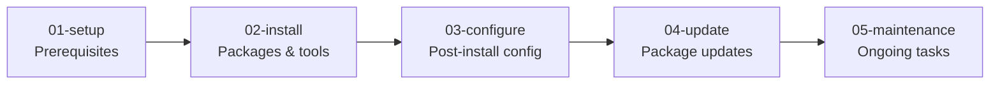
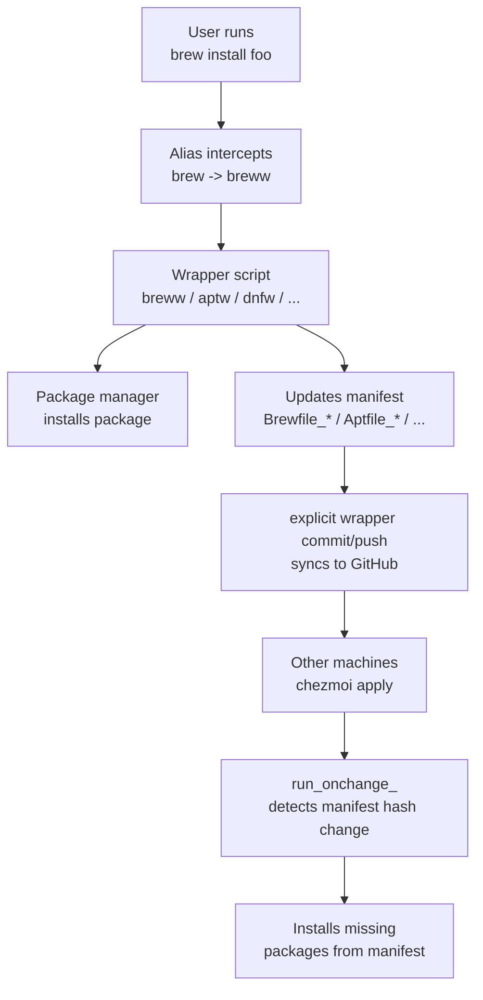
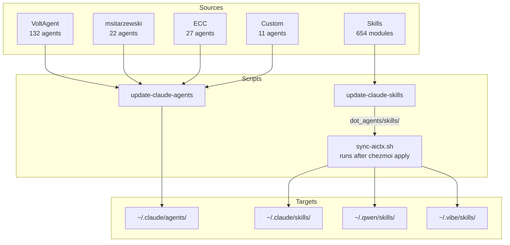
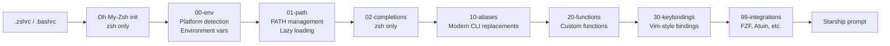

# Architecture

This document describes how the chezmoi dotfiles system works: how files flow from this repository to your home directory, how platform profiles are detected, and how the various subsystems (packages, agents, shells) are orchestrated.

## System Overview



Key inputs:
- **`.chezmoi.toml.tmpl`** -- profile detection, user data, encryption config
- **`.chezmoiexternal.toml.tmpl`** -- Oh-My-Zsh, zsh plugins, TPM (weekly refresh)
- **`.chezmoiignore.tmpl`** -- conditional file exclusion per platform

## Profile Detection

The `machine_profile` variable is the primary branching mechanism. It is resolved once during `chezmoi init` and stored in `~/.config/chezmoi/chezmoi.toml`.



See the [README profile table](../README.md#-platform-profiles) for the full feature matrix per profile.

## 5-Phase Lifecycle

Scripts in `.chezmoiscripts/` are organized into numbered phases. chezmoi runs them in lexicographic order based on trigger type.



**Trigger types:**
- `run_once_` -- runs once per machine (state tracked by chezmoi)
- `run_onchange_` -- re-runs when file content hash changes
- `run_always_` -- runs on every `chezmoi apply`

### Script Reference

| Phase | Script | Trigger | Platform |
|-------|--------|---------|----------|
| 01 | `setup-macos.sh` | once | macOS |
| 01 | `setup-linux.sh` | once | Linux |
| 02 | `install-1password.sh` | once | macOS, Linux |
| 02 | `install-1password.ps1` | once | Windows |
| 02 | `install-linuxbrew.sh` | once | Linux desktop (not RPi, not Atomic) |
| 02 | `install-linux-flatpak.sh` | once | Linux (Flatpak support) |
| 02 | `install-toolboxes.sh` | once | Fedora Atomic only |
| 02 | `install-opencode-tools.sh` | once | Desktop profiles |
| 02 | `install-claude-plugins.sh` | once | Desktop profiles |
| 02 | `install-windows-packages.ps1` | once | Windows |
| 02 | `brew-bundle.sh` | onchange | macOS, Linux (Homebrew) |
| 02 | `install-linux-packages.sh` | onchange | Linux |
| 03 | `configure-atuin.sh` | once | All (interactive) |
| 03 | `configure-gpg.sh` | once | macOS (1Password) |
| 03 | `configure-linux.sh` | once | Linux |
| 03 | `configure-mail.sh` | onchange | All |
| 03 | `generate-ssh-config.sh` | onchange | All |
| 03 | `sync-aictx.sh` | after apply | All |
| 04 | `update-appstore.sh` | onchange | mac-personal |
| 04 | `update-homebrew.sh` | onchange | macOS |
| 04 | `update-linux.sh` | onchange | Linux |
| 04 | `update-windows.ps1` | onchange | Windows |
| 05 | `maintenance-container.sh` | always | All |

## Package Management

Every supported package manager has a wrapper script that installs packages **and** updates a tracked manifest. The manifest change triggers chezmoi's `run_onchange_` scripts on all machines.



| Wrapper | Package Manager | Manifest | Platforms |
|---------|----------------|----------|-----------|
| `breww` | Homebrew | `Brewfile_macos` (macOS) / `Brewfile_brew_only` (Linux) + profile | macOS, Linux |
| `aptw` | APT | `Aptfile_{debian,rpi,ubuntu_desktop,ubuntu_server}` | Debian, Ubuntu, RPi |
| `dnfw` | DNF/YUM | `Dnffile_{fedora_desktop,fedora_server}` | Fedora |
| `pacmanw` | Pacman | `Pacfile_{arch_desktop,arch_server}` | Arch |
| `yayw` | YAY (AUR) | `Pacfile_aur_desktop` | Arch |
| `ostreew` | rpm-ostree | `Rpmfile_fedora_atomic` | Fedora Atomic |
| `scoopw` | Scoop | `Scoopfile.json` | Windows |

All manifests live in `dot_private/` (mapped to `~/.private/`).

## AI Agent & Skill Ecosystem



**Plugins** (managed via `run_once_install-claude-plugins.sh`):
- `octo@nyldn-plugins` -- Claude Octopus multi-AI orchestrator (39 commands, 32 personas, 50 skills)
- LSP plugins: lua, pyright, swift, typescript, gopls

**Commands**: 60 slash commands in `dot_claude/commands/` (`/plan`, `/verify`, `/code-review`, `/tdd`, `/build-fix`, language builds/reviews, etc.)

**Rules**: 64 rule files in `dot_claude/rules/` (common best practices + 12 language-specific: TypeScript, Python, Rust, Go, Swift, C++, C#, Java, Kotlin, Perl, PHP)

**Hooks**: `rtk-rewrite.sh` (token optimization on Bash calls), `claude-island-state.py` (state tracking), `console-log-check.sh` (debug statement warnings), `config-protection.sh` (protected file guard), `desktop-notify.sh` (macOS/Linux notifications)

**MCP Servers**: 19 provided by the vendored `dot_claude/private_settings.json` (context7, fetch, github, 1password, playwright, 4x cloudflare, token-optimizer, etc.)

## Shell Configuration



Numbered files are loaded in order. See [dot_zsh/README.md](../dot_zsh/README.md) and [dot_bash/README.md](../dot_bash/README.md) for details.

## Template System

Templates use [Go text/template](https://pkg.go.dev/text/template) with chezmoi extensions. Common patterns:

- **Platform branching**: `{{ if eq .chezmoi.os "darwin" }}...{{ end }}`
- **Tool detection**: `{{ if lookPath "op" }}...{{ end }}`
- **Environment checks**: `{{ if env "TOOLBOX_PATH" }}...{{ end }}`
- **1Password secrets**: `{{ onepasswordRead "op://vault/item/field" }}`

See [CLAUDE.md Templating Patterns](../CLAUDE.md#templating-patterns) for code examples.

**Testing templates locally:**

```bash
chezmoi execute-template < dot_config/tool/config.toml.tmpl
chezmoi diff   # preview what would change
chezmoi cat    # show rendered content of a managed file
```

## External Dependencies

Managed via `.chezmoiexternal.toml.tmpl`. Git repos are cloned and refreshed every 168 hours (1 week):

| Path | Repository | Purpose |
|------|-----------|---------|
| `.oh-my-zsh` | ohmyzsh/ohmyzsh | Shell framework |
| `.oh-my-zsh/custom/plugins/zsh-autosuggestions` | zsh-users/zsh-autosuggestions | Shell suggestions |
| `.oh-my-zsh/custom/plugins/zsh-syntax-highlighting` | zsh-users/zsh-syntax-highlighting | Syntax highlighting |
| `.config/tmux/plugins/tpm` | tmux-plugins/tpm | Tmux plugin manager |
| `.wallpapers` | orangci/walls-catppuccin-mocha | Desktop wallpapers |

Wallpapers are only fetched on `mac-personal` and `ubuntu-desktop` profiles. Everything is skipped on `fedora-atomic`.

## Security Architecture

- **Secrets**: managed via 1Password CLI (`op`) or age encryption. Never hardcoded.
- **Age encryption**: identity file at `~/.config/chezmoi/key.txt`, recipient public key from 1Password.
- **File permissions**: `private_` prefix in chezmoi sets 0600 on target files.
- **SSH config**: generated from 1Password vault. Gracefully skips when 1Password is unavailable.
- **MCP tokens**: environment variable references (`${ENV_VAR}`) resolved at runtime.
- **`.chezmoiignore`**: excludes `secrets.zsh` and platform-inappropriate files.

See the [README Security section](../README.md#-security--secrets) for operational details.
